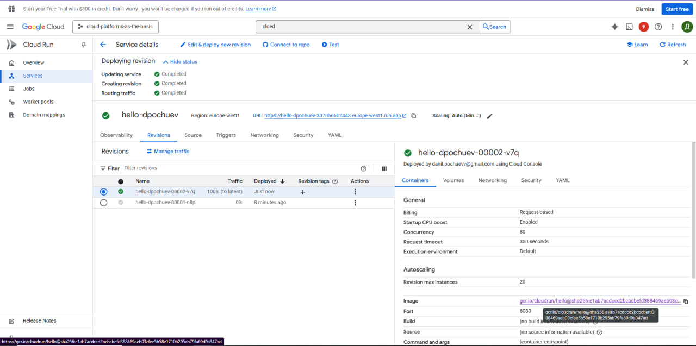
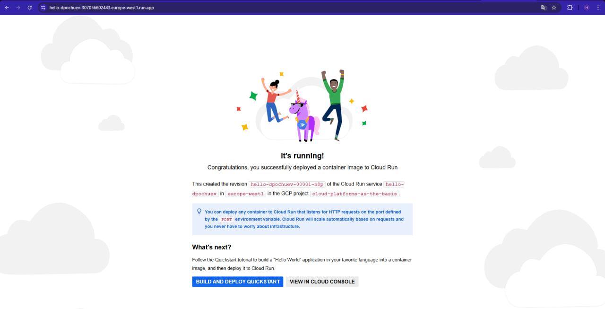
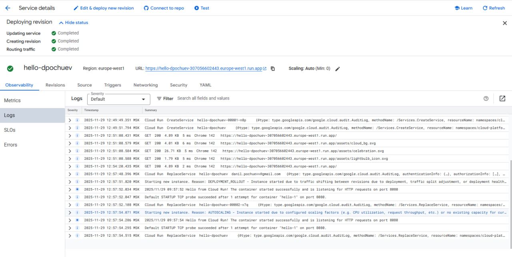
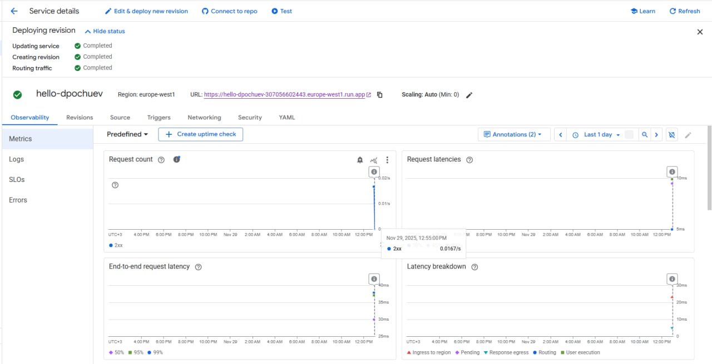
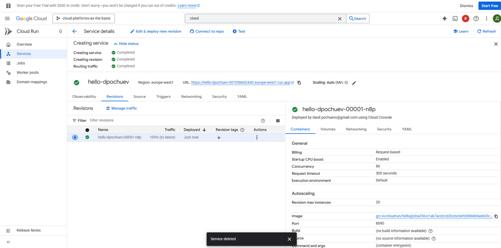

# Лабораторная работа №2: "Работа с Cloud Run"

## Выполненные действия

### 1. Создание сервиса Cloud Run
- Развернул сервис Cloud Run, используя стандартный шаблон "Hello" с минимальными ресурсами.
- Настроил базовую конфигурацию с автоматическим масштабированием.

### 2. Тестирование сервиса
- Перешел по сгенерированному Cloud Run URL-адресу.
- Убедился, что сервис корректно отвечает, отображая страницу с приветствием.

### 3. Анализ мониторинга
- Изучил раздел **Логи (Logs)** в консоли Cloud Run, проверил записи о запусках контейнера и HTTP-запросах.
- Проанализировал **Метрики (Metrics)**, включая количество запросов, задержки и использование ресурсов.

### 4. Изменение конфигурации порта
- Изменил конфигурацию сервиса, указав порт **8090** вместо стандартного.
- Наблюдал за поведением сервиса - все работало.

### 5. Завершение работы
- Удалил все созданные сервисы Cloud Run и связанные ревизии.
- Подготовил подробный отчет с скриншотами каждого этапа работы, включая логи, метрики и настройки распределения трафика.

## Выводы
В ходе работы успешно освоил основы работы с бессерверной платформой Cloud Run, получил практический опыт развертывания контейнеров, управления версиями, распределения трафика и анализа мониторинга. Исследовал важность правильной конфигурации портов для работоспособности сервиса.