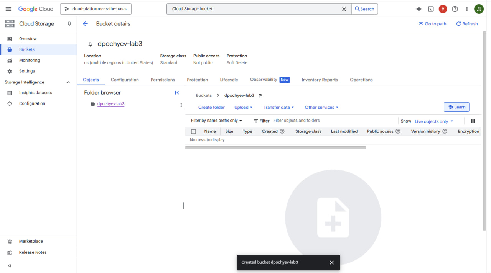
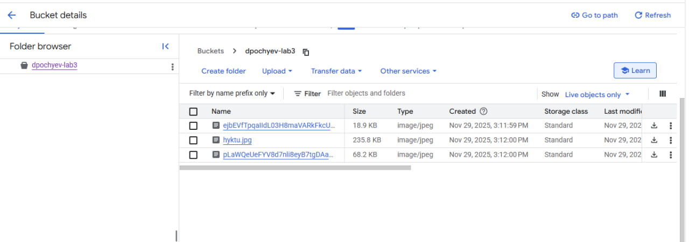
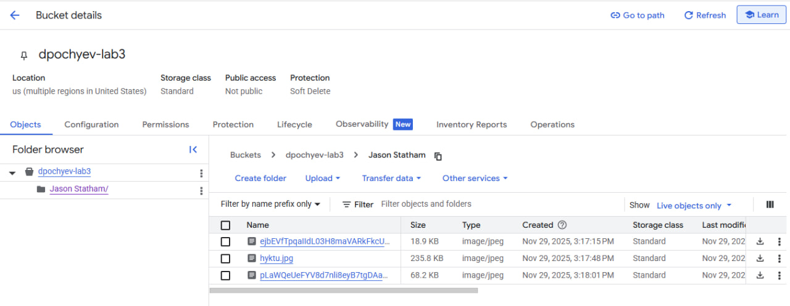

University: ITMO University
Faculty: FTMI
Course: Облачные платформы как основа тхнологического предпринимательства
Year: 2025/2026
Group: U4225
Author: Pochuev Danil Valerevich
Lab: Lab3
Date of create: 28/11/2025
Date of finished: 30/11/2025

# Лабораторная работа №3: "Работа с облачным хранилищем данных"

## Выполненные действия

### 1. Подготовка проекта
- Выбрал существующий проект в Google Cloud Platform, где имелись необходимые разрешения для работы с Cloud Storage.

### 2. Создание бакета
- Создал новый бакет в Cloud Storage с уникальным именем, соответствующим требованиям глобальной уникальности.
- Выбрал регион размещения и класс хранения в соответствии с рекомендациями.

### 3. Загрузка файлов
- Загрузил 3 различных изображения в созданный бакет через веб-консоль Google Cloud.
- Убедился в успешной загрузке всех файлов.

### 4. Организация файловой структуры
- Создал папку с названием "Jason Statham" внутри бакета.
- Переместил все загруженные изображения в созданную папку, организовав таким образом структуру хранения.

### 5. Настройка прав доступа
- Настроил публичный доступ к файлам через настройки бакета:
  - Изменил разрешения на уровне бакета
  - Назначил роль "Storage Object Viewer" для всех пользователей (allUsers)
- Убедился, что настройки приватности применяются корректно.

### 6. Генерация публичных ссылок
- Для каждого изображения создал публичную ссылку через контекстное меню файла.
- Протестировал доступность файлов по сгенерированным ссылкам из браузера.

### 7. Завершение работы
- Удалил созданный бакет со всем его содержимым.
- Подготовил подробный отчет с скриншотами всех этапов работы, включая настройки доступа и тестирование публичных ссылок.

## Выводы
В ходе работы успешно освоил основы работы с объектным хранилищем Cloud Storage, получил практический опыт создания бакетов, организации файловой структуры, управления правами доступа и настройки публичного доступа к файлам. Изучил принципы объектного хранения данных в облачной среде.