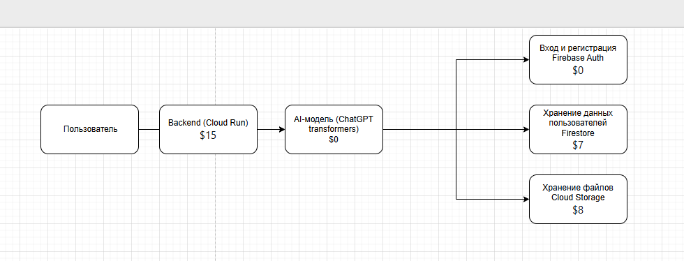
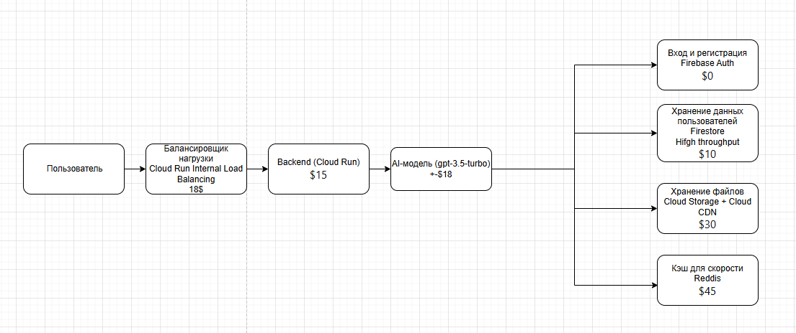

University: ITMO University
Faculty: FTMI
Course: Облачные платформы как основа тхнологического предпринимательства
Year: 2025/2026
Group: U4225
Author: Pochuev Danil Valerevich
Lab: Lab4
Date of create: 28/11/2025
Date of finished: 30/11/2025

# MVP 1 - Обоснование выбора и стоимость

## Обоснование инструментов

- **Firebase Auth** - Бесплатно до 10K пользователей, готовая аутентификация за 5 минут
- **Firestore** - NoSQL база, не нужно схемы, автомасштабирование, проще чем SQL
- **Cloud Storage** - Дешевое хранение файлов, простое API, встроенная CDN
- **Cloud Run** - Платим только когда код работает, автомасштабирование, не нужно управлять серверами
- **Transformers** - Бесплатные локальные ML модели, работают оффлайн, нет API лимитов

## Итоговая стоимость

| Компонент | Стоимость в месяц |
|-----------|-------------------|
| Firebase Auth | $0 |
| Firestore | $7 |
| Cloud Storage | $8 |
| Cloud Run | $15 |
| Transformers | $0 |
| Cloud Build | $5 |
| **Итого** | **$35** |

**Пользователей:** до 100 активных в месяц

## Почему это оптимально для старта

- **Экономично** - $35 это 2 пиццы вместо месячной инфраструктуры
- **Быстро** - Развертывание за 1 день, а не неделю
- **Просто** - Минимум управления, максимум кодирования
- **Масштабируемо** - Можно легко перейти на MVP 2 когда появятся пользователи

**Вывод:** Идеальный стек для проверки гипотезы с бюджетом как у студента

# MVP 2 - Обоснование выбора и стоимость

## Обоснование инструментов

- **Firebase Auth** - Сохраняем для continuity, бесплатно до 10K пользователей
- **Firestore High Throughput** - Увеличиваем производительность для растущей нагрузки
- **Cloud Storage + Cloud CDN** - Ускоряем доставку файлов для пользователей в разных регионах
- **Redis** - Добавляем кэширование для частых запросов, снижаем нагрузку на БД
- **Cloud Run Internal Load Balancing** - Распределяем нагрузку между сервисами
- **Cloud Run Backend** - Масштабируем backend для обработки большего числа запросов
- **GPT-3.5 Turbo** - Переходим на продвинутую модель для лучшего качества ответов

## Итоговая стоимость

| Компонент | Стоимость в месяц |
|-----------|-------------------|
| Firebase Auth | $0 |
| Firestore High Throughput | $10 |
| Cloud Storage + Cloud CDN | $30 |
| Redis | $45 |
| Cloud Run Internal Load Balancing | $18 |
| Cloud Run Backend | $15 |
| GPT-3.5 Turbo | $18 |
| **Итого** | **$136** |

## Вместимость MVP 2

**Прогноз нагрузки:**
- 10,000 запросов в день
- 200 одновременных пользователей
- 1 GB новых файлов в день
- 100,000 операций с базой в день
- 50,000 токенов GPT в день

**Пользователей:** до 1,000 активных в месяц

# MVP 3 - Обоснование выбора и стоимость

## Обоснование инструментов

- **Cognito User Pools** - Переход на enterprise-аутентификацию с расширенными функциями безопасности
- **Firestore High Throughput** - Высокопроизводительная NoSQL БД для больших объемов данных
- **Cloud Storage + Cloud CDN** - Глобальное хранение файлов с ускоренной доставкой
- **Redis** - Мощный кластер кэширования для высоконагруженной системы
- **ClickHouse** - Column-oriented БД для аналитики и быстрых отчетов
- **Pub/Sub** - Асинхронная обработка задач и межсервисная коммуникация
- **Cloud Run Internal Load Balancing** - Продвинутая балансировка нагрузки между сервисами
- **Cloud Run Backend** - Масштабируемый backend кластер для обработки миллионов запросов
- **GPT-3.5 Turbo** - Оптимизированная AI-модель для баланса качества и стоимости

## Итоговая стоимость

| Компонент | Стоимость в месяц |
|-----------|-------------------|
| Cognito User Pools | $10 |
| Firestore High Throughput | $10 |
| Cloud Storage + Cloud CDN | $90 |
| Redis | $400 |
| Сбор логов | $0 |
| ClickHouse Analytics | $40 |
| Pub/Sub Queues | $40 |
| Cloud Run Internal Load Balancing | $18 |
| Cloud Run Backend | $80 |
| GPT-3.5 Turbo | $150 |
| **Итого** | **$838** |

## Вместимость MVP 3

**Прогноз нагрузки:**
- 100,000+ запросов в день
- 1,000+ одновременных пользователей
- 10+ GB новых файлов в день
- 1M+ операций с базой в день
- 500,000+ токенов GPT в день

**Пользователей:** до 10,000 активных в месяц
