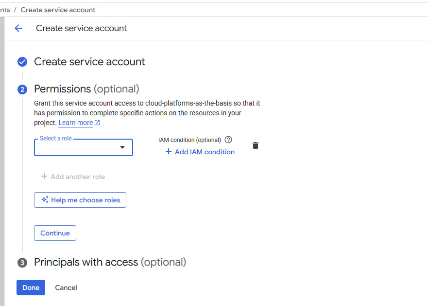
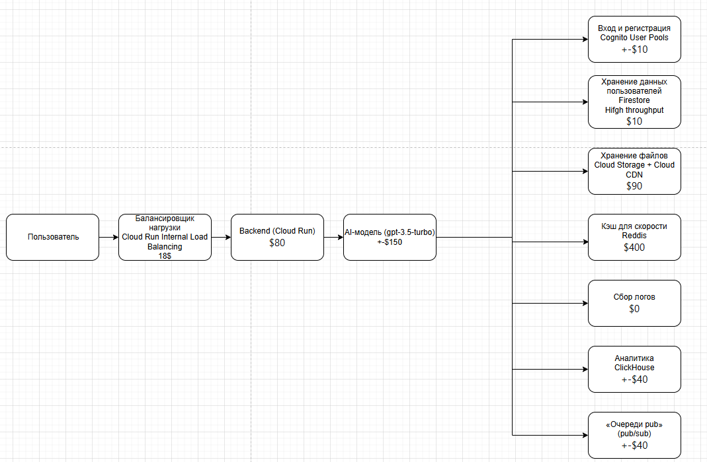
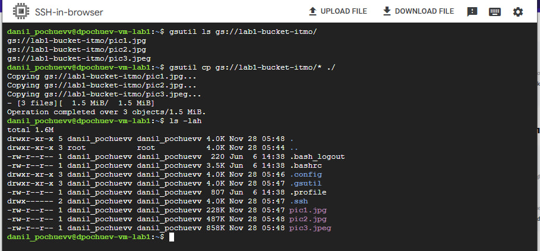
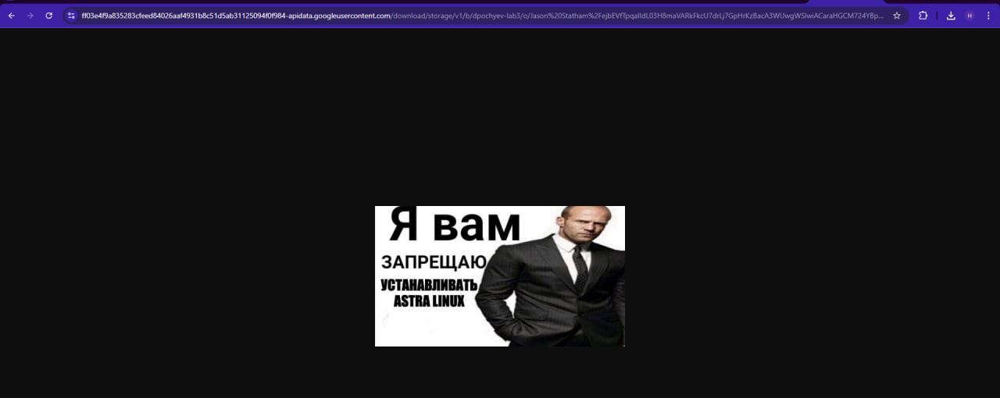

University: ITMO University
Faculty: FTMI
Course: Облачные платформы как основа тхнологического предпринимательства
Year: 2025/2026
Group: U4225
Author: Pochuev Danil Valerevich
Lab: Lab1
Date of create: 28/11/2025
Date of finished: 28/11/2025

# Лабораторная работа №1: "Обзор Google Cloud и исследование основных сервисов"

## Выполненные действия

### 1. Получение доступа к Google Cloud
- Заполнил форму, указав свой Gmail для получения доступа к Google Cloud Platform.

### 2. Создание сервисного аккаунта
- Во вкладке IAM создал сервисный аккаунт с ролью `Storage Admin`.

### 3. Развертывание виртуальной машины
- Создал виртуальную машину (Compute Engine) с конфигурацией:
  - Machine type: `e2-micro`
  - Режим: `spot`

### 4. Работа с Cloud Storage
- Подключился к созданной VM по SSH.
- С помощью утилиты `gsutil` нашел бакет
- Скопировал 3 файла из бакета в локальную папку на VM.
- Выполнил команду `ls -lah` для проверки наличия скопированных файлов.

### 5. Исследование управления правами доступа
- Вернулся в консоль IAM и изменил роль сервисного аккаунта с `Storage Admin` на `Compute Viewer`.
- Попытался повторить операцию копирования файлов - операция завершилась ошибкой.
- Сделал вывод о критической важности назначения правильных ролей для выполнения операций.

### 6. Завершение работы
- Удалил все созданные сервисы:
  - Виртуальную машину
  - Сервисный аккаунт
- Оформил отчет с подробными скриншотами каждого этапа работы.

## Выводы
В ходе работы успешно ознакомился с основными сервисами Google Cloud, получил практический опыт работы с IAM, Compute Engine и Cloud Storage, а также исследовал влияние ролевой модели доступа на выполнение операций в облачной среде.